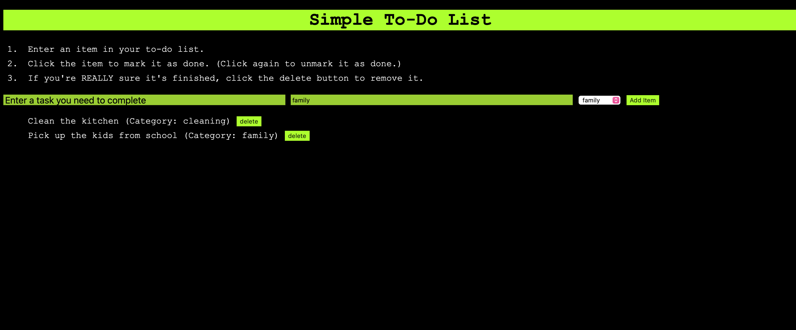

# Simple To-Do List
This simple JavaScript webpage allows users to create and maintain a to-do list, with their list saving to browser memory.
## Features
* Add items to your to-do list
* Use basic categories or add a custom category
* Mark an item as done (without deleting it)
* Delete an item when completely finished with the task
## Screenshot
